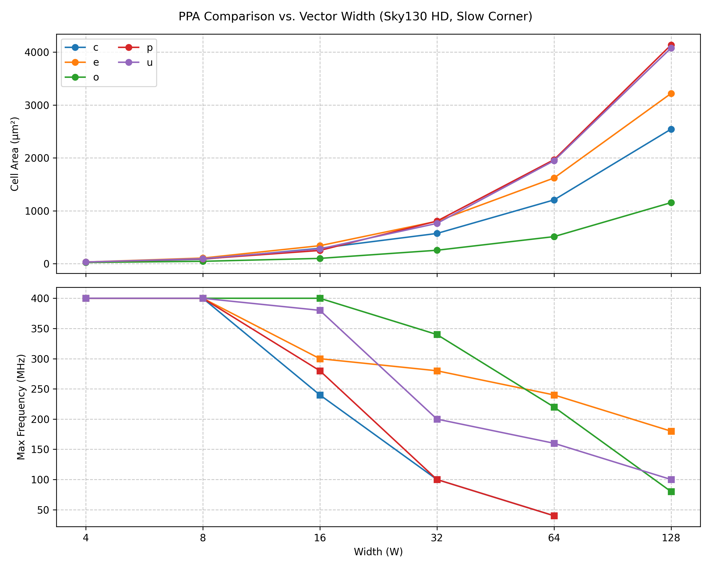

# u

A collection of efficient circuits to determine if an arbitrary length input vector is a valid unary encoding.

## Synopsis

Unary (also called Thermometer) codes are common in logic design. The projects contained herein are an exploration of various unary-code detection strategies in logic. For the day-to-day logic designer, such circuits are too small to become relevant in a non-trivial design, but in the context of a small, portfolio piece they are interesting for a small weekend PPA exploration.

## Unary Numbers

A unary number represents a non-negative integer by repeating a single symbol (usually 1) that many times. The all-one code is disallowed.

Examples (for a fixed vector width of 8b):

`'d0 -> 'b00000000`  
`'d1 -> 'b00000001`  
`'d3 -> 'b00000111`  
`'d5 -> 'b00011111`  
`'d7 -> 'b01111111`  


In hardware, unary ("thermometer") encodings aid priority detection and transition checking via contiguous runs.

## Realizations

#### (U) Mask-Based [u.sv](./rtl/u/u.sv):

Admit an input vector if the format is a sequence of ones followed by a sequence of zeros.

Compute a lo- and hi- mask of a contiguous span of ones and a contiguous span of zeros. Match on spans for each possible transition location in the input vector. Redundant recomputation on lo- and hi- masks can be efficiently eliminated by Common Subexpression Elimination during synthesis, but still logic area may be high for large W. 

#### (E) Edge-Based [e.sv](./rtl/e/e.sv):

Admit an input vector if there is at most one edge transition across the span.

Edge detection between adjacent bits is performed efficiently using an XOR. 1-hot detection is sub-linear complexity on W. Some additional qualification is required on final decision to determine final result. This does not represent a timing concern.

#### (P) Incrementer-Based [p.sv](./rtl/p/p.sv): 

Admit an input vector if, once incremented, the resultant vector is one-hot encoded.

An increment operation performed by a CLA has a sub-linear complexity on W. The 1-hot detection at the output of the incrementer has sub-linear complexity on W. A conditional invert is required on the input to the incrementer. The CLA can be performed efficiently in logic for large W, but the implicit serialization of the prioritization operations may present a timing concern.

#### (C) Prefix-based [c.sv](./rtl/c/c.sv)

Admit an input vector if all prefix sub-vectors are themselves valid partial unary encodings.

An array of cells is used to detect a valid unary encoding from LSB to MSB. The LSB of the vector must be a valid value for a unary encoding: 1'b1 in the normal-form case, 1'b0 in the complimented-form case. Detect presence of edges with increasing index. The presence of duplicate edges in the vector kills the match operation. Exactly one edge must be present to match a valid unary encoding. The final index must correspond to a valid terminal value for the unary encoding: 1'b0 in the normal-form case, 1'b1 in the complimented-form for case. Circuit complexity is linear on W and is therefore inefficient when compared against the other solutions. Solution is noteworthy due to its non-trivial circuit implementation.

#### (O) Incrementer-based [o.sv](./rtl/o/o.sv)

Admit an input vector if its increment does not overlap with the original value.

Unary codes are a unique encoding where the carry-out is at the first zero bit in the input vector. This is the canonical solution to the unary detection problem.

## Physical Analysis



### Results

PPA characteristics of each project are presented below (where each entry is a 2-tuple representing post-synthesis cell-area in um^2, and maximum clock frequency in MHz).

| Project | W=4 | W=8 | W=16 | W=32 | W=64 | W=128 | Notes |
| :---: | :---: | :---: | :---: | :---: | :---: | :---: | :--- |
| c (serial) | (31.28, 400)| (83.83, 400)| (291.53, 240)| (571.80, 100)| (1206.16, 40)| (2544.94, <40)| Linear, worst |
| e (edge) | (31.28, 400)| (106.35, 400)| (340.33, 300)| (802.02, 280)| (1620.30, 240)| (3219.34, 180)| Sub-Linear (best overall?) |
| o (optimal) | (23.77, 400)| (45.04, 400)| (100.10, 400)| (253.99, 340)| (511.74, 220)| (1154.86, 80)| Expected Winner |
| p (inc) | (31.28, 400)| (90.09, 400)| (250.24, 280)| (805.77, 100)| (1966.89, 40)| (4136.47, <40)| Good Area, Timing Risk |
| u (mask) | (31.28, 400)| (95.09, 400)| (280.27, 380)| (761.98, 200)| (1946.87, 160)| (4078.91, 100)| High area growth |

All projects attain similar PPA for small widths, but soon diverge thereafter. 'o' appears optimal overall in term of frequency and area but is unable to reach high clock frequencies for high W. 'e' appears invariant to large W, but does so with a non-trivial area. 'c' operates serially and, as predicted, does not scale to high W. The above figures and associated table can be re-rendered by running the run_synthesis_flow target.

### Methodology
Individual projects were synthesized to netlist using Yosys/Synlig Open Source synthesis tools. Resultant netlist was analyzed using OpenSTA to determine the minimum clock frequency with > 0 TNS. The High-Density SkyWater 130nm PDK was used (sky130_fd_sc_hd) at a 100C/1.60v corner. Neither OpenSTA nor SkyWater support Wire-Load Models therefore timing analysis was done in the absence of net-delays. As a projects are fully-combinatorial, a common top-level was created to flop-bound the design. The area due to the synchronous cells (common to all projects) was then deducted from the overall cell area figure. No attempt has been made to verify logical equivalence between RTL and synthesized netlists.


## Instructions

The [Dockerfile](./.devcontainer/Dockerfile) is the recommended development environment for 'u'. Alternatively, 'u' can be built standalone using a recent version of Verilator (developed using v5.034). In this case, an additional environment variable 'VERILATOR_ROOT' pointing to the root of a Verilator installation is required. 

```shell
# Compile library for some pre-defined configuration (W=32)
cmake . --preset w32c
cmake --build build_w32c -t tb

# List available designs
./build_w32c/tb/tb --list_designs
e
u
c
p
o

# List available tests
./build_w32c/tb/tb --list_tests
DirectedExhaustiveTestCase
FullyRandomizedTestCase

# Run a test on design
./build_w32c/tb/tb -d -t d=u,t=DirectedExhaustiveTestCase
```

